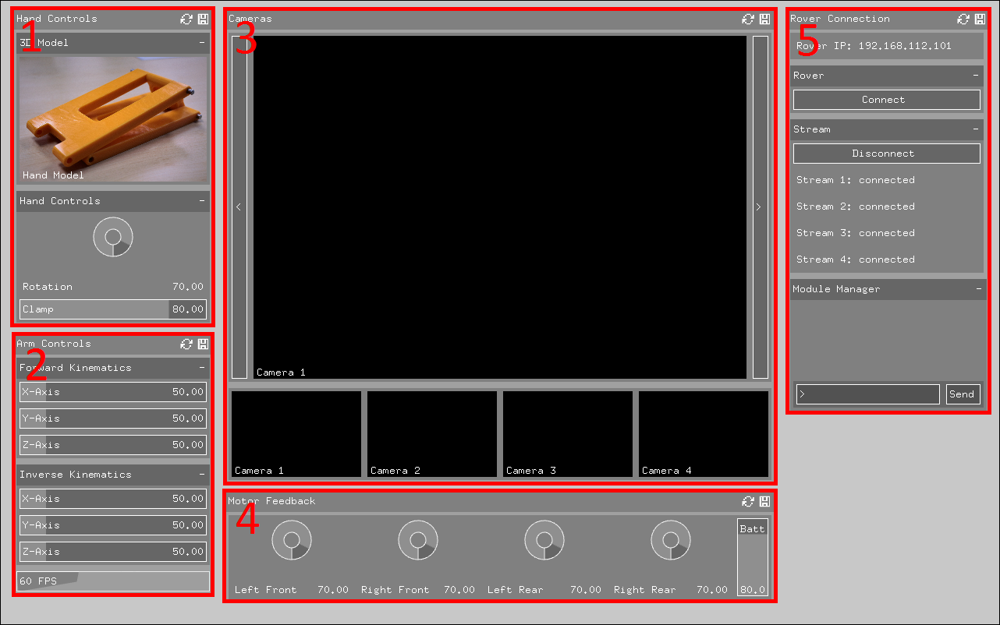

# Ground Station Application
description
## Installation
Requires:
* Latest master branch of openframeworks
* [ofxGuiExtended addon](https://github.com/frauzufall/ofxGuiExtended)
* [ofxIPVideoGrabber addon](https://github.com/bakercp/ofxIpVideoGrabber)

In addition, to compile add the lib and include paths for Poco have to be manually added and in IPVideoGrabber::draw() all instances of vec3 must be replaced with vec2

## Usage
ip.cfg contains rover ip, rover tcp port, stream base port, and module manager tcp port. If not present it is generated with defaults.

1. Hand panel: 
2. Arm panel: 
3. Streams: Arrows on right and left of main view switch between cameras.
4. Drive panel: 
5. Rover Connection panel: module manager console accepts `start`, `stop`, and `query` and `startall`, `stopall`, and `queryall`. `queryall` can be used to list available modules.
